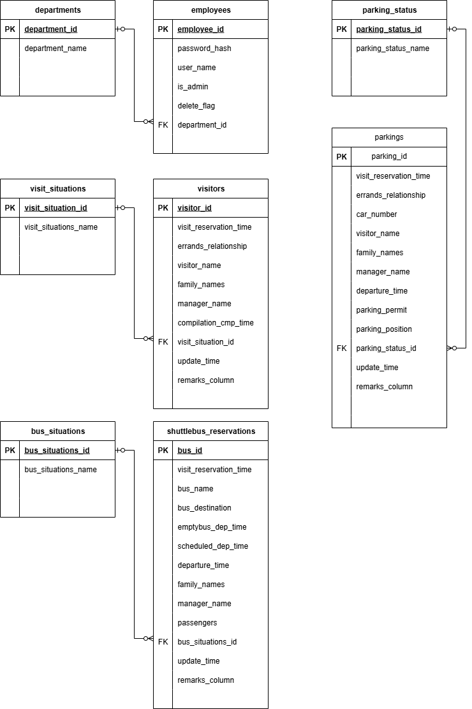
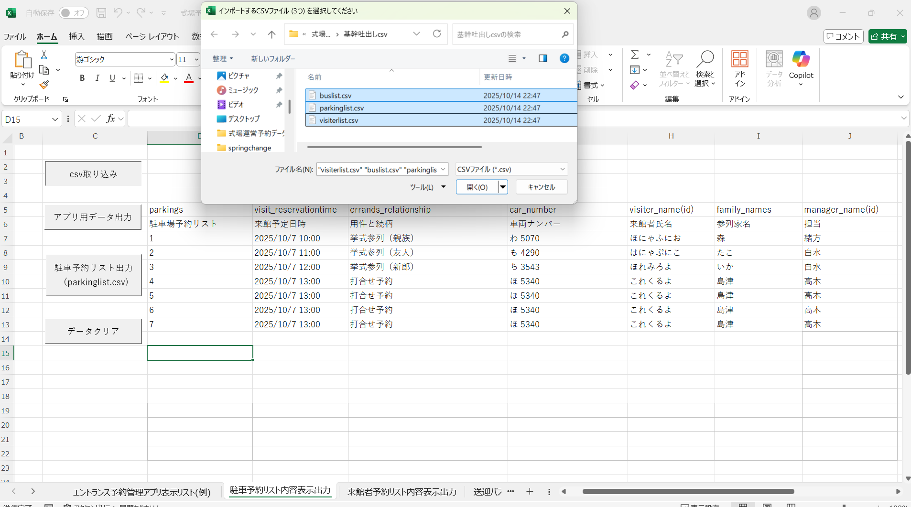
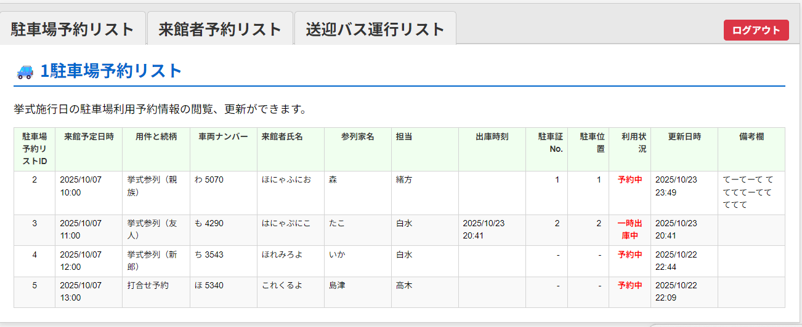
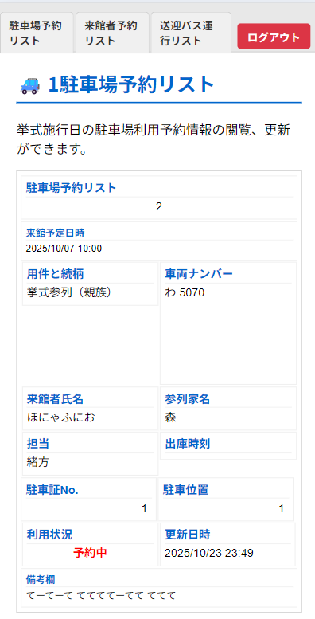
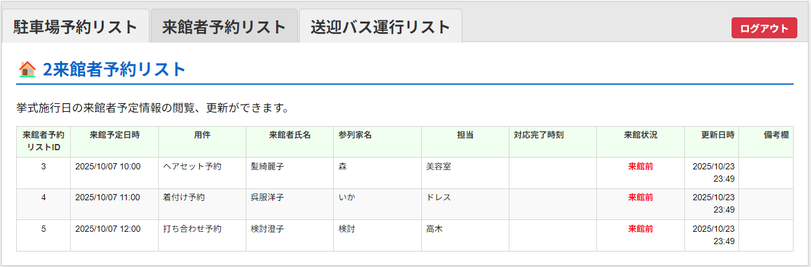
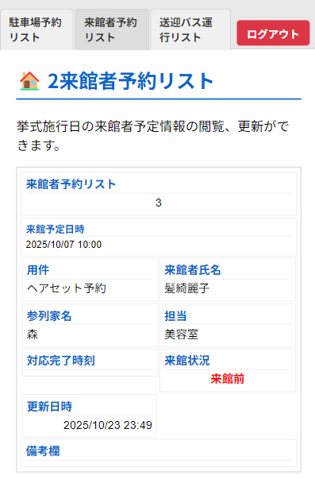
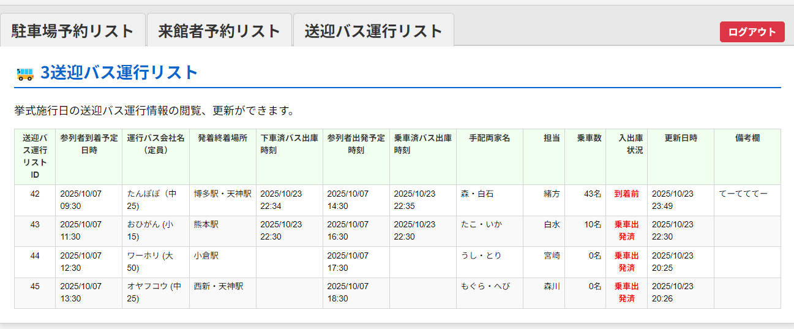
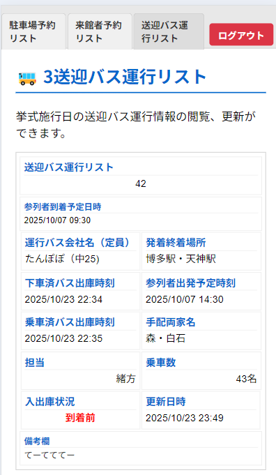

---

# 💒 エントランス業務円滑化・顧客満足度向上アプリ

## 🎯 プロジェクトの目的とゴール

式場エントランス業務の**デジタル化とリアルタイム情報共有**により、来館者対応を円滑化し、顧客満足度の向上を目指します。

| 目的 | 詳細 |
| :--- | :--- |
| **業務円滑化** | 送迎バス、駐車場、予約情報を一元管理し、エントランス業務のボトルネックを解消。 |
| **情報共有** | 他部門（美容室等、運営各部門）とリアルタイムで情報を共有し、連携ミスを防止。 |
| **顧客体験向上** | 待ち時間短縮、スムーズな案内を実現し、来館者の顧客満足度を向上。 |
| **負担軽減** | エントランス担当者の情報管理・確認の業務負担を大幅に軽減。 |

---

## 💻 システム構成の概要

本アプリは、既存の基幹システムと連携する**VBA**プログラムと、現場のリアルタイム操作を担う**Java**アプリケーションの二層構造で構成されます。

| 要素 | 役割 | 技術 |
| :--- | :--- | :--- |
| **データ抽出・整形** | 全体予約情報から必要な情報を抽出・整形し、CSVファイルで出力。 | **VBA** |
| **リアルタイム管理** | CSVデータを取り込み、DB展開後、当日情報をリアルタイムで閲覧・更新。 | **Java (SQL DB連携)** |
| **インターフェース** | 現場で操作しやすいGUIを提供。 | **Java (GUI)** |

---

## 💻 使用技術

このプロジェクトは、以下の開発環境で構築・動作することを想定しています。

| カテゴリ | 詳細 |
| :--- | :--- |
| **制作環境** | Eclipse, EXEL |
| **使用言語** | Java, SQL, HTML, CSS, JavaScript, VBA |
| **ブラウザ** | Google Chrome |
| **データベース** | MySQL 8.0 |
| **WEBサーバー** | Apache |
| **アプリケーションサーバー** | Tomcat 10.1 |

---

## 📜 ER図

プロジェクトのデータベース構造を示すER図です。

---

## ⚙️ 各機能の詳細

### 1. VBA（データ連携・整形プログラム）

基幹システムと管理アプリを繋ぐインフラとして機能します。

| 機能 | 内容 |
| :--- | :--- |
| **データ取り込み** | 運営日の予約情報を基幹システムからCSVファイルで取得。 |
| **情報整形** | Javaアプリケーションに渡すために必要な情報リスト（送迎バス、駐車場、来館者予約）に整形。 |
| **CSV出力** | 整形したデータをCSV形式でアウトプット。 |

 

    
【画像 : csv取り込みVBA画面】

    

### 2. Java（リアルタイム管理アプリケーション）

現場の運用を支える核となる機能です。

| 機能 | 内容 |
| :--- | :--- |
| **データ展開** | VBAで整形されたCSVデータを取り込み、SQLデータベーステーブルへ展開。 |
| **情報表示** | SQL DBから情報を取り込み、カテゴリー（バス/駐車場/来館者）毎に一覧表示。 レスポンシブ対応により、モバイル端末からの参照が可能 |
| **リアルタイム操作** | 予約者の来館済マーク、バスの到着/出発、駐車場入出庫、ステータス変更（キャンセル等）を即座に反映。 レスポンシブ対応により、モバイル端末からの更新が可能 |
| **通知機能** | 特定のステータス変更時、メッセージ更新時に自動通知。(実装予定）|

---

## 📊 GUI構成（3カテゴリーリスト）

現場での視認性と操作性を重視し、情報を3つの主要なカテゴリーに分けて表示します。

1.  **駐車場予約リスト**
    * 来館者名、車両ナンバー、予約時間、入庫/出庫ステータスを一覧表示。

 

    
【画像 1: PC表示画面】

    

 

    
【画像 2: モバイル表示画面】

    

 

2.  **来館者予約リスト**
    * 美容室利用者、打ち合わせ来館者をリスト化し、来館済ステータスを管理。
 

    
【画像 1: PC表示画面】

    

 

    
【画像 2: モバイル表示画面】

    

 

3.  **送迎バス運行リスト**
    * 運行ルート、到着/出発時刻、現在のステータス（運行中、到着済など）を管理。
 

    
【画像 1: PC表示画面】

    

 

    
【画像 2: モバイル表示画面】

    

---

## 🔮 追加実装（未来）

更なる業務効率化と顧客体験の向上を目指した拡張機能です。

| 機能 | 内容 | 目的 |
| :--- | :--- | :--- |
| **人感センサー連動** | 更衣室などに人感センサーを設置し、アプリと連動。 | 更衣室の使用状況をリアルタイムで管理し、利用者の待ち時間や混雑を可視化。 |
